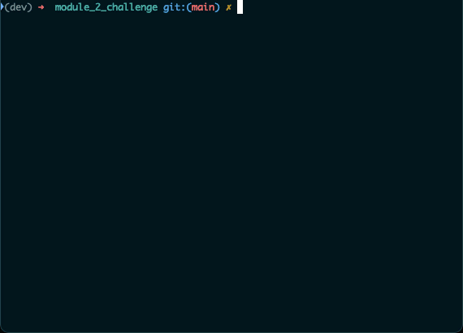

# QualifyingLoans2CSV

A CLI loan qualifier application that imports a CSV of available loans, qualifies them based on user input, and exports a list of qualifying loans to CSV.

---

## Technologies

- Python 3.7.10
- Fire 0.4.0
- Questionary 1.9.0

---

## Installation Guide

1.  Clone this repo to your local machine

        git clone https://github.com/woodedlawn/module_2_challenge.git
        cd module_2_challenge

2.  Install the dependencies

        conda install -c conda-forge --file requirements.txt

    or

        pip install -r requirements.txt

3.  Run the app

        python app.py

---

## Usage / Example

---

## Contributors

---

## License

GNU GPLv3
